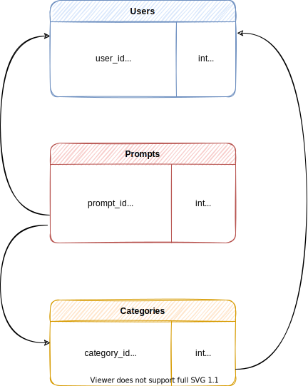

# codeop_fs15_soloproject
This is a student project that was created at CodeOp, a full stack development bootcamp in Barcelona.

## Description
A prompt repository where users can add prompts and take inspiration for writting or drawing.

- The main idea is that users can input ideas they would like to be transformed into fan fiction or fan art.
- Writers and artists can take inspiration from these ideas, and then link their creations in each prompt.

### Requirements

- The user needs to add information in text inputs.
- The information will be stored in a database with 3 tables:
    - User table.
    - Prompts table.
    - Category table.
- Possibility of showing all the prompts of a user.
- Possibility t show, add, edit and delete the prompts.
- Sections / pages:
    - Main page. Where all prompts are shown.
    - User form. Where users can register.
    - Prompt form. Where the user can add a prompt.
    - User section. Where the user can see all their prompts and info.

## Database tables draft

## API routes draft
