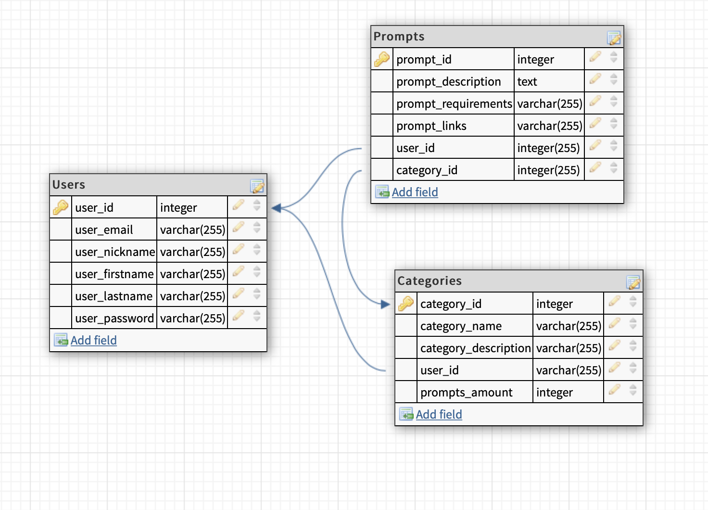
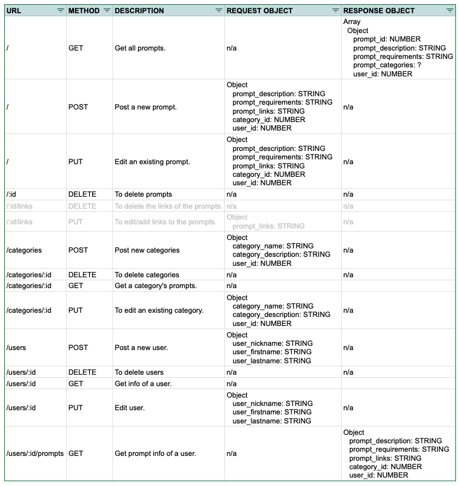

# INSTRUCTIONS FOR INSTALLATION

# codeop_fs15_soloproject
This is a student project that was created at CodeOp, a full stack development bootcamp in Barcelona.

## Description
A prompt repository where users can add prompts and take inspiration for writting or drawing.

- The main idea is that users can input ideas they would like to be transformed into fictional stories or art.
- Writers and artists can take inspiration from these ideas, and then link their creations in each prompt (fork).

## How to run this project
### Backend
In the project folder run:

```
yarn

```
then

```
yarn start

```
### Frontend

```
cd client
```
then
```
yarn start
```


## Database tables draft



## API routes draft


| URL | METHOD | DESCRIPTION | REQUEST OBJECT | RESPONSE OBJECT | DONE |
|-----|--------|-------------|----------------|-----------------|------------|
| /   | GET    | Get prompts. | n/a | Array  Object  prompt_id: NUMBER  prompt_description: STRING prompt_requirements: STRING  prompt_categories: STRING  user_id: NUMBER" | y |
| /:id   | GET    | Get a prompt. | n/a | Object  prompt_id: NUMBER  prompt_description: STRING prompt_requirements: STRING  prompt_categories: STRING  user_id: NUMBER" | y |
| / | POST | Post prompt. |   Object  prompt_description: STRING  prompt_requirements: STRING  prompt_links: STRING  category_id: NUMBER  user_id: NUMBER" | n/a | y | 
| /:id | DELETE | Delete prompt. | n/a | n/a | y |
| /categories | GET | Get categories. | n/a | Array  Object  category_name: STRING  category_description: STRING  user_id: NUMBER | n/a | y |
| /categories/:id | GET | Get category. | n/a | update | y |
| /categories/:id/prompts | GET | Get category's prompts. | n/a | update | y |
| /categories | POST | Post category. | Object  category_name: STRING  category_description: STRING  user_id: NUMBER | n/a | y |
| /categories/:id | DELETE | Delete category. | n/a | n/a| y |
| /users:id | GET | Get user. | n/a | update | y |
| /users | POST | Post a new user. | Object  category_name: STRING  category_description: STRING  user_id: NUMBER | n/a | y |
| /users/:id | DELETE | Delete user. | n/a | n/a | y |


High level of what the app is
Why you made it (ie use case, who would use it)?
What technologies you used to build it (don't leave anything out - from design to implementation)?
What were the major steps taken to build it (ie the process)?
Potential future features in a second iteration.
What was most challenging?
What you feel most proud of?
